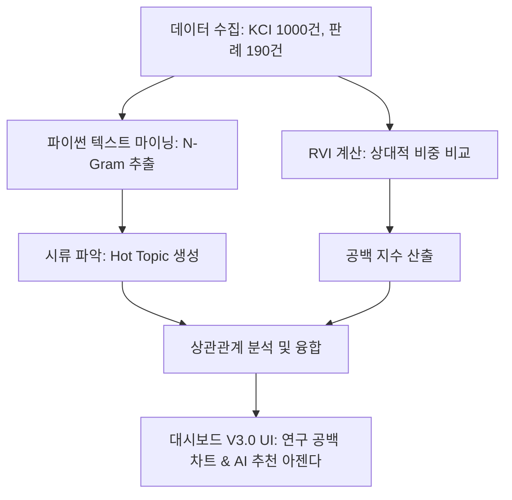

# 🚀 AI Tech-Legal Dashboard V3.0 프로젝트 고도화 계획

본 계획서는 KCI 학술 데이터(1,000건)와 법원 판례 데이터(190건)를 연동한 대시보드를 기반으로, **학계 연구와 실제 사법 판단 사이의 격차(Gap)를 식별하고 실무 연구 아젠다를 제안**하는 의사결정 지원형 대시보드(V3.0) 구축 로드맵입니다.

---

## 📅 지난 성과 (Phase 1 & 2 완료)
*   **코드 모듈화:** HTML, CSS, JavaScript로 구조 분할 및 디자인 개편 완료
*   **실시간 API 연동:** KCI OpenAPI 및 국가법령정보 OpenAPI를 이용한 실시간 수집 자동화 완료
*   **데이터 규모 확장:** KCI 데이터 1,000건 및 판례 190건(키워드 AI, 알고리즘, 딥러닝, 머신러닝 확장) 수집 완료
*   **시각화 정규화:** 학술과 판례 간의 스케일 차이를 보정하는 이중 축/정규화(0-100%) 그래프 도입 및 커스텀 툴팁 개발 완료

---

## 🎯 Phase 3 핵심 목표: 격차 분석 및 연구 공백 탐색 (V3.0)

대시보드의 단순 통계 요소를 제거하고, **텍스트 마이닝과 수치화된 Gap 분석을 융합하여 독창적인 인사이트를 도출**합니다.

### 1. 화면 구성 최적화 (불필요한 노이즈 제거)
*   **제거 대상:**
    *   `Top Legal Risk Area` (요약 카드) -> 너무 일차원적인 결과 카드 제거
    *   `Top Research Fields` (도넛 차트) -> 학계의 행정적 대분류 정보 제거 (시각적 공간 확보)
*   **신규 레이아웃:** 텍스트 마이닝을 통한 시류 매트릭스와 Gap 분석 결과에 맞게 공간을 효율적으로 재배치합니다.

### 2. 시류 파악을 위한 텍스트 마이닝 (Text Mining & Word Clustering)
*   **방법:** 파이썬(`data_analyzer.py`) 단에서 논문 제목/초록 및 판례 사건명/요지의 핵심 텍스트를 파싱하여 **구체적인 명사구 및 N-Gram(단어 조합)을 추출**합니다.
*   **효과:** 단순히 "개인정보"가 아닌, **`[가명정보 결합]`, `[딥페이크 성착취물]`, `[오픈마켓 책임]`** 등 시대를 반영하는 세부 테크-레갈 트렌드를 발굴합니다.

### 3. 연구-사법 격차 상관관계 규명: 연구 공백 지수 (Research Void Index - RVI)
학술(Academia) 연구 빈도와 판례(Law) 발생 빈도 사이의 상관관계를 통계적으로 비교하여 **구체적인 연구 공백 지수를 산출**합니다.
*   **RVI (연구 공백 지수) 공식:** 
    $$\text{RVI} = \left(\frac{\text{특정 키워드의 판례 수}}{\text{전체 판례 수}} \times 100\right) - \left(\frac{\text{특정 키워드의 논문 수}}{\text{전체 논문 수}} \times 100\right)$$
*   **RVI 해석 스펙트럼:**
    *   **강한 양수 (+): `🚨 연구 공백 위험 영역`** -> 소송은 빗발치는데 연구가 전무하여 실무적 해결책이 시급한 주제
    *   **강한 음수 (-): `🏛️ 상아탑 전용 연구 영역`** -> 이론적 연구는 성행하나 실제 법적 갈등은 발생하지 않은 주제
    *   **0에 수렴:** 학술적 관심과 법적 현실이 균형을 이루는 영역

### 4. 시류(텍스트 마이닝)와 공백(RVI)의 상관관계 기반 인사이트 고도화
*   대시보드 하단의 인사이트 박스를 **"연구 설계 도우미 (Recommended Research Agenda)"**로 고도화합니다.
*   *"소송이 급증하는 핫 토픽(N-Gram)"*과 *"연구 공백(RVI)"*의 상관관계를 규명하여, 사용자에게 구체적인 연구 주제와 필요성을 추천합니다.

---

## 🛠️ 세부 구현 로드맵

### [Step 1] 백엔드 데이터 분석 고도화 (`data_analyzer.py`)
- KCI/판례 텍스트 데이터의 형태소 분석(정규식 및 명사 단위 결합 처리) 개발
- 주제별 RVI 연산 로직 구현 및 `dashboard_data.js` 내에 데이터 스키마 삽입

### [Step 2] 프론트엔드 시각화 업그레이드 (`index.html` & `script.js`)
- 도넛 차트를 **'연구 공백 리더보드 (Research Void Leaderboard)'** 또는 **'RVI 매트릭스 차트'**로 변경
- 요약 카드 중 불필요한 것들 제거 후 핵심 지표로 재배치
- 텍스트 마이닝 결과(Hot Topic N-Gram)를 트렌디하고 가시성이 뛰어난 UI 형태로 표현

### [Step 3] AI 추천 아젠다 컴포넌트 개발 (`script.js`의 `renderInsights`)
- RVI와 Hot N-Gram의 결합 조건에 대응하는 동적 추천 알고리즘 작성
